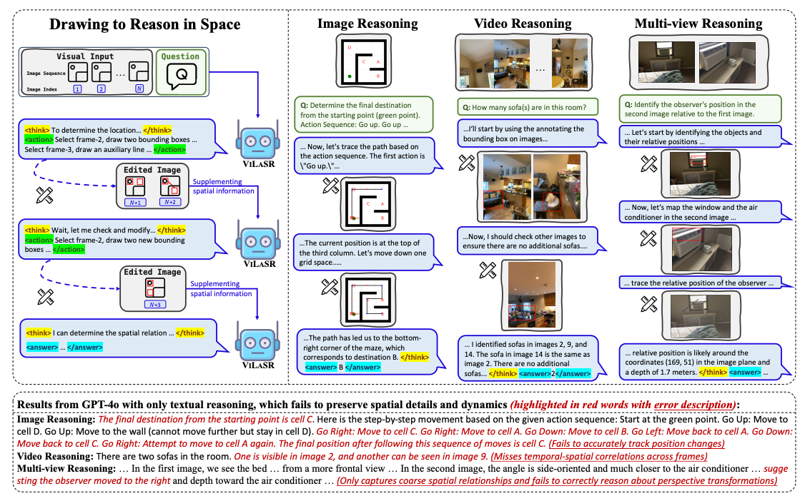

# ViLaSR: Reinforcing Spatial Reasoning in Vision-Language Models with Interwoven Thinking and Visual Drawing

<!-- <div align="center"> -->
[](https://arxiv.org/abs/2506.09965)
[](https://huggingface.co/AntResearchNLP/ViLaSR)
<!-- [](https://opensource.org/licenses/MIT) -->
<!-- </div> -->


## 📢 News
- [2025.06] Data, code and model weights will be released soon. Please stay tuned! 🔥

## 📋 Overview
<p align="center">
    
</p>

> As textual reasoning with large language models (LLMs) has advanced significantly, there has been growing interest in enhancing the multimodal reasoning capabilities of large vision-language models (LVLMs). However, existing methods primarily approach multimodal reasoning in a straightforward, text-centric manner, where both reasoning and answer derivation are conducted purely through text, with the only difference being the presence of multimodal input. As a result, these methods often encounter fundamental limitations in spatial reasoning tasks that demand precise geometric understanding and continuous spatial tracking—capabilities that humans achieve through mental visualization and manipulation. To address the limitations, we propose drawing to reason in space, a novel paradigm that enables LVLMs to reason through elementary drawing operations in the visual space. By equipping models with basic drawing operations, including annotating bounding boxes and drawing auxiliary lines, we empower them to express and analyze spatial relationships through direct visual manipulation, meanwhile avoiding the performance ceiling imposed by specialized perception tools in previous tool-integrated reasoning approaches. To cultivate this capability, we develop a three-stage training framework: cold-start training with synthetic data to establish basic drawing abilities, reflective rejection sampling to enhance self-reflection behaviors, and reinforcement learning to directly optimize for target rewards. Extensive experiments demonstrate that our model, named VILASR, consistently outperforms existing methods across diverse spatial reasoning benchmarks, involving maze navigation, static spatial reasoning, video-based reasoning, and multi-view-based reasoning tasks, with an average improvement of 18.4%. Ablation studies reveal the critical role of each training stage, where reflective rejection sampling strengthens the model’s self-correction capabilities, and reinforcement learning effectively unlocks its reasoning potential.

## 🚀 Coming Soon
- [x] Model weights  
- [x] Training code, Inference code 
- [ ] Cold start data, evaluation data is coming in these two days

## Quickstart

### 1. Data Preparation
Download the cold-start, reflective rejection sampling and reinforcement learning dataset [ViLaSR-data](https://huggingface.co/datasets/AntResearchNLP/ViLaSR-data). Put the downloaded dataset to `ViLaSR-data`.

Then unzip the data
```
python unzip.py
```


The `dataset_info.json` has been formatted in accordance with the [formatting guidelines]((https://github.com/hiyouga/LLaMA-Factory/blob/main/data/README.md)) for instruction tuning.


For example:
```
"vqa_cold_start": {
		"file_name": "cold_start/vqa.json",
		"formatting": "sharegpt",
		"columns": {
			"messages": "conversations",
			"images": "images"
		},
		"tags": {
			"role_tag": "role",
			"content_tag": "content",
			"user_tag": "user",
			"assistant_tag": "assistant",
			"system_tag": "system"
		}
	},
"SR_91k_reflective": {
		"file_name": "reflective_rejection_sampling/SR_91k.json",
		"formatting": "sharegpt",
		"columns": {
			"messages": "conversations",
			"images": "images"
		},
		"tags": {
			"role_tag": "role",
			"content_tag": "content",
			"user_tag": "user",
			"assistant_tag": "assistant",
			"system_tag": "system"
		}
	}
```

The `ViLaSR-data` directory includes cold_start, reflective rejection sampling and reinforcement learning data. Its structure should be (we omit the detailed structure):
```
│──cold_start
│	 ├──GPT4Scene/
│	 ├──maze/
│	 ├──SR_91k/
│	 ├──vqa/
│	 ├──GPT4Scene.json
│	 ├──maze.json
│	 ├──SR_91k.json
│	 ├──vqa.json
│──reflective_rejection_sampling
│	 ├──GPT4Scene
│	 │	 ├──...
│	 ├──...
│──rl
│	 ├──GPT4Scene-All
│	 │	 ├──...
│	 ├──vilasr_rl_data.json
│──dataset_info.json
```

### 2. Training
#### 2.1 Cold-start

We use [LLaMA-Factory](https://github.com/hiyouga/LLaMA-Factory) to finetune the model and put the training script in `train/cold_start`. You can use `8` or `4*8` GPUs of 80G memory to train it. And we recommend use multiple nodes for distributed training (refer to [distributed training on multiple nodes](https://github.com/hiyouga/LLaMA-Factory/blob/main/examples/README.md#full-parameter-fine-tuning)).

You should replace the path of ViLaSR-ColdStart-33k dataset for the `config_cold_start.yaml`, such as `train/cold_start/vilasr_full_qwen2.5_vl_7b/config_cold_start.yaml`.

```
dataset: vqa_cold_start,maze_cold_start,GPT4Scene_cold_start,SR_91k_cold_start    # specify dataset name
dataset_dir: /path/to/ViLaSR-data     # the ViLaSR-data path
```

Then, use the following script to start the training.

```
cd ViLaSR
bash train/cold_start/vilasr_full_qwen2.5_vl_7b_32gpu/train_cold_start.sh   # for distributed training
bash train/cold_start/vilasr_full_qwen2.5_vl_7b_8gpu/train_cold_start.sh    # for single gpu training
```

#### 2.2 Reflective Rejection Sampling

You should replace the path of ViLaSR-RSS-8k dataset for the `config_reflective.yaml`, such as `train/reflective_rejection_sampling/vilasr_full_qwen2.5_vl_7b/config_reflective.yaml`.

```
dataset: vqa_reflective,maze_reflective,GPT4Scene_reflective,SR_91k_reflective    # specify dataset name
dataset_dir: /path/to/ViLaSR-data                                                 # the ViLaSR-data path
```

Then, use the following script to start the training.

```
cd ViLaSR
bash train/reflective_rejection_sampling/vilasr_full_qwen2.5_vl_7b/train_reflective.sh
```

#### 2.3 RL Training

We use [EasyR1](https://github.com/hiyouga/EasyR1) to train the model by reinforcement learning and put the training script in `train/rl`. You can use `8` or `4*8` GPUs of 80G memory to train it. We recommend use `ray` for multi-node training, refer to [EasyR1 in Multi-node](https://github.com/hiyouga/EasyR1?tab=readme-ov-file#how-to-run-70b-model-in-multi-node-environment)

Then, use the following script to start the training.

```
cd ViLaSR
## if use distributed training, start ray head node and worker node first.
bash train/rl/train_grpo.sh       
```

### 3. Inference & Evaluation

You can download the pretrained models:
- [ViLaSR](https://huggingface.co/AntResearchNLP/ViLaSR)
- [ViLaSR-cold-start](https://huggingface.co/AntResearchNLP/ViLaSR-cold-start)

Then, update the checkpoint path in the following line of `eval/infer.sh` with the actual path where you saved the downloaded models:
```
# The MODE variable can be set to: [zero_shot, cold_start, reflective, rl]. This helps distinguish between different stages or settings.
CKPT=/path/to/ckpt
MODE=xxx  
```

As we modify the benchmark files for unified evaluation, we recommend using our provided json files and scripts for evaluation.

The json files and images can be downloaded at: [ViLaSR-eval](https://huggingface.co/datasets/AntResearchNLP/ViLaSR-eval), put them in `./benchmark/`. (⚠️ Note: This files is currently incomplete, as we are in the process of uploading image files.)


After configuration, run the inference script:

```
sh eval/infer.sh
```

Finally, conduct evaluation on the results:

```

```

## Acknowledgment

We sincerely appreciate the valuable contributions from the open-source community. This work builds upon the following projects: [LLaMA-Factory](https://github.com/hiyouga/LLaMA-Factory), [verl](https://github.com/volcengine/verl) and [EasyR1](https://github.com/hiyouga/EasyR1).

## 📖 Citation
If you find our work helpful, please cite our paper:
```bibtex
@misc{wu2025reinforcingspatialreasoningvisionlanguage,
      title={Reinforcing Spatial Reasoning in Vision-Language Models with Interwoven Thinking and Visual Drawing}, 
      author={Junfei Wu and Jian Guan and Kaituo Feng and Qiang Liu and Shu Wu and Liang Wang and Wei Wu and Tieniu Tan},
      year={2025},
      eprint={2506.09965},
      archivePrefix={arXiv},
      primaryClass={cs.CV},
      url={https://arxiv.org/abs/2506.09965}, 
}
```


